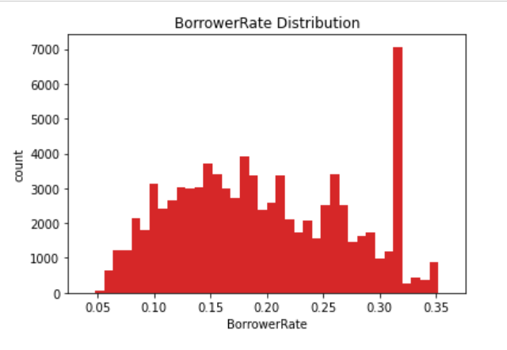
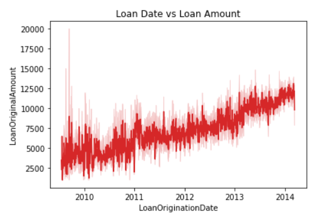
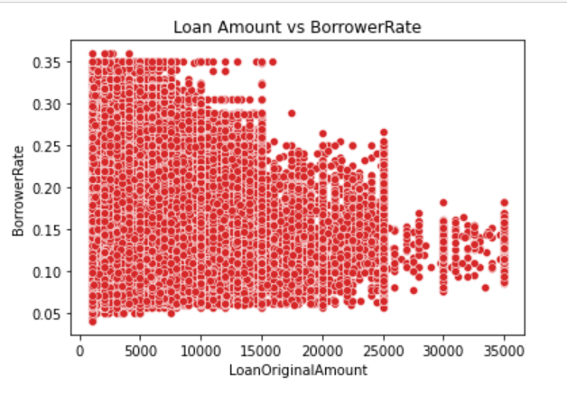

<h1 align="center">Communicate Data Findings</h1>

## Installation

This project uses Python3 and is designed to be completed through the Jupyter Notebooks IDE. It is highly recommended that you use the [Anaconda distribution](https://www.anaconda.com/distribution/) to install Python, since the distribution includes all necessary Python libraries as well as Jupyter Notebooks. The following libraries are expected to be used in this project:

- Numpy
- Pandas
- Matplotlib
- Seaborn

### Project Overview

This project has two parts that demonstrate the importance and value of data visualization techniques in the data analysis process. In this first part, you will conduct an exploratory data analysis on a dataset of your choice. Use Python data science and data visualization libraries to explore the dataset’s variables and understand the data’s structure, oddities, patterns, and relationships. In the second part, you will take your main findings from your exploration and convey them to others through an explanatory analysis. To this end, you will create a slide deck that leverages polished, explanatory visualizations to communicate your results. This part of the project should make heavy use of the first part of the project.

## Project Motivation

This is an Udacity Nanodegree project. I was interested in using Prosper Loan Data to better understand :  

- Univariate Exploration:
  - Loan status
  - Employment Status
  - Stated Monthly Income
- Bivariate Exploration:
  - Status and Prosper Rating
  - Credit Start with Listing Category
  - Loan Status and Loan Amount
  - Prosper Rating and Employment Status
- Multivariate Exploration:
  - Rating, Loan Amount and Loan Status
  - Credit category, Credit rating and outcome of Credit
  - Amount, Listing Category Loan and Loan Status Interact

#### Dataset

- Personally, I was more interested in using Prosper Loan Data. Here you can find some details about it:
  [Loan Data from Prosper](https://www.google.com/url?q=https://s3.amazonaws.com/udacity-hosted-downloads/ud651/prosperLoanData.csv&sa=D&ust=1554486256021000)
- [Prosper Data Dictionary to Explain Dataset's Variables](https://www.google.com/url?q=https://docs.google.com/spreadsheet/ccc?key%3D0AllIqIyvWZdadDd5NTlqZ1pBMHlsUjdrOTZHaVBuSlE%26usp%3Dsharing&sa=D&ust=1554486256024000)

#### Explore Your Data

Explore your data and document your findings in a report. The report should briefly introduce the dataset, then systematically walk through the points of exploration that you conducted. You should have headers and text that organize your thoughts and findings. Visualizations in this part of the project need not be completely polished: this is just your own exploration at this point. However, you should still make sure that you adhere to principles of using appropriate plot types and encodings so that accurate conclusions can be drawn, and that you have enough comments and labeling so that when you return to your work, you can quickly grasp your analysis steps.

#### Create your Slide Deck

Follow the plans you laid out in the previous step and create a slide deck with explanatory data visualizations to tell a story about the data you explored. You can start with code that you used in your exploration, but you should make sure that the code is revised so that your plots are polished. Make sure that you also pay attention to aspects of design integrity in your revisions.

### More about the Dataset

This data set contains 113,937 loans with 81 variables on each loan, including loan amount, borrower rate (or interest rate), current loan status, borrower income, and many others. For the purpose of my investigation, I selected the following attributes to work with: Term, LoanStatus, BorrowerRate, ProsperRating (Alpha), ListingCategory (numeric), Occupation, EmploymentStatus, DelinquenciesLast7Years, StatedMonthlyIncome, TotalProsperLoans, LoanOriginalAmount, LoanOriginationDate, Recommendations and Investors.

### Insights

Here's a summary of some insights that I came up with after doing my explorations:

- We can clearly see that rates are from 0.05 to 0.35 at most. The distribution of the BorrowerRate is quite strange, but we can say that most borrowers have a rate of approximatively 0.32.

  

- Another insight concerns loan date and loan amount, from the plot below, we can notice that as the loan date increases, the Loan Amount increases. However we do have some noise here and there.

  

- From the scatter plot below, we can see that when the LoanOriginalAmount increases, the BorrowerRate decreases.

  

- Most frequent category in the `Occupation` column is Other. But since we don't have much information about what `Other` category includes. We say that most of borrowors we have in this Dataset are Professionals, Executives, and Computer programmers.
- The distribution of Stated Monthly Income is highly skewed to the right. After zooming-in, we can see that the distribution of monthly income is still skewed to the right with a mode of 5000.

To see all the visualizations, please head to the exploration notebook.
